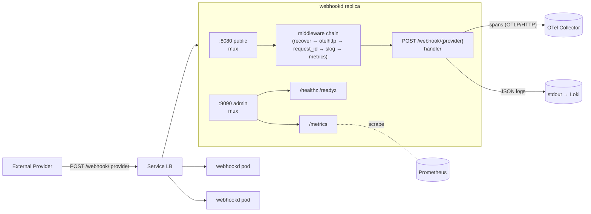

<!-- markdownlint-disable-file MD025 MD041 -->

# DESIGN 0001: Stateless Webhook Receiver — Phase 1

**Status:** Draft **Author:** Donald Gifford **Date:** 2026-04-21

<!--toc:start-->

- [Overview](#overview)
- [Goals and Non-Goals](#goals-and-non-goals)
  - [Goals](#goals)
  - [Non-Goals](#non-goals)
- [Background](#background)
- [Detailed Design](#detailed-design)
  - [Architecture](#architecture)
  - [Module Layout](#module-layout)
  - [Configuration (env vars)](#configuration-env-vars)
  - [HTTP Endpoints](#http-endpoints)
  - [Middleware Chain](#middleware-chain)
  - [Observability](#observability)
    - [Metrics](#metrics)
    - [Tracing](#tracing)
    - [Logging](#logging)
  - [Webhook Handler Flow](#webhook-handler-flow)
  - [Graceful Shutdown](#graceful-shutdown)
- [API / Interface Changes](#api--interface-changes)
- [Data Model](#data-model)
- [Testing Strategy](#testing-strategy)
- [Migration / Rollout Plan](#migration--rollout-plan)
- [Open Questions](#open-questions)
- [References](#references)
<!--toc:end-->

## Overview

Phase 1 of a stateless HTTP service (`webhookd`) that receives webhook
deliveries from external providers, validates them, and emits a domain event.
The service is designed to run as a horizontally scaled Kubernetes Deployment
with no persistent state: every replica is interchangeable and crash-safe. The
emphasis of this phase is the **scaffolding and observability substrate** — a
production-grade instrumentation stack (Prometheus + OpenTelemetry + slog) that
later phases can layer business logic onto without re-plumbing.

## Goals and Non-Goals

### Goals

- A single Go binary, built against Go 1.23+, using the standard library for
  routing, HTTP server, configuration parsing, and logging.
- First-class Prometheus metrics covering HTTP-layer behaviour, webhook domain
  outcomes, and Go runtime health — exposed on a separate admin listener so
  scraping cannot interfere with webhook traffic.
- First-class OpenTelemetry tracing with OTLP/HTTP export, automatic HTTP server
  instrumentation via `otelhttp`, and manual spans around business logic
  checkpoints.
- Trace-correlated structured logs: every log line emitted while handling a
  request carries `trace_id` and `span_id`, so Grafana / Loki / Tempo
  drill-downs work out of the box.
- Configuration exclusively via environment variables, following the `WEBHOOK_*`
  and standard `OTEL_*` namespaces. No config files, no CLI flags, no runtime
  reloads in Phase 1.
- HMAC-SHA256 signature verification for webhook payloads, using a shared secret
  from the environment (rotatable by redeploying).
- Graceful shutdown on `SIGTERM` / `SIGINT` with bounded drain time, flushing
  in-flight traces and honoring in-flight HTTP requests.
- Liveness and readiness probes on the admin listener.
- Reference a clear pattern for adding new metrics, new spans, and new webhook
  providers — documented in the companion walkthrough doc so engineers joining
  the service can extend it without reading the source.

### Non-Goals

- **Persistence / replay / dead-letter.** If an upstream consumer is
  unavailable, this phase returns a non-2xx and relies on the provider's retry
  semantics. A durable queue lands in Phase 2.
- **Multi-provider abstraction.** Phase 1 ships with a single provider adapter
  as the reference implementation. A provider registry lands in Phase 2.
- **Authn for the `/metrics` endpoint.** Assumes network isolation (in-cluster
  ServiceMonitor scrape). mTLS / auth lands if we move the admin listener
  outside the mesh boundary.
- **Metric push.** Prometheus pulls; we do not push to a gateway.
- **Log aggregation transport.** We write JSON to stdout. Collecting stdout into
  Loki / Cloudwatch / Splunk is a platform concern.
- **Custom OTel metrics.** We standardize on Prometheus for metrics in Phase 1.
  OTel is used only for traces. Unifying onto the OTel SDK for both signals is
  Phase 3 work.
- **Horizontal autoscaling rules, SLO definitions, alert rules.** These belong
  to an accompanying ops doc and ADR, not this design.

## Background

Three things motivate a new service rather than bolting webhook intake onto an
existing API:

1. **Failure domain separation.** Webhook ingress has a distinct traffic profile
   (bursty, adversarial, signature-verified) and blast radius. Isolating it in
   its own Deployment lets it scale and fail independently of the consuming
   systems.
2. **Observability as a first-class requirement, not retrofit.** Every previous
   service where metrics and tracing were added after the fact accumulated
   cardinality bombs, un-sampled hot paths, and ad-hoc log formats. Building the
   observability spine first makes the instrument surface a design contract
   rather than a vendor afterthought.
3. **stdlib-forward baseline.** Go 1.22 brought method+pattern routing to
   `http.ServeMux`, and Go 1.21 gave us `log/slog`. Together these eliminate
   most of the classic reasons to pull in chi/gorilla/zerolog /logrus. A smaller
   dependency graph means fewer supply-chain surfaces (relevant for a service
   that will live on the edge of the network), and faster upgrade velocity.

The only third-party libraries Phase 1 pulls in are the
`prometheus/client_golang` family, the core OpenTelemetry SDK, and the
`otelhttp` contrib instrumentation — each of which is effectively unavoidable
for its respective signal.

## Detailed Design

### Architecture



Two HTTP listeners per pod:

- **Public listener (`:8080` by default)** — serves webhook traffic. Any failure
  here affects provider delivery.
- **Admin listener (`:9090` by default)** — serves `/metrics`, `/healthz`,
  `/readyz`. Isolated port so a runaway scrape cannot starve the webhook mux,
  and so Kubernetes can continue to see the pod as alive even if the public
  listener is wedged on a bad handler (useful for kill-and-respawn semantics).

### Module Layout

```
webhookd/
├── cmd/
│   └── webhookd/
│       └── main.go              # wiring only — no logic
├── internal/
│   ├── config/
│   │   └── config.go            # env parsing, validation, defaults
│   ├── observability/
│   │   ├── logging.go           # slog handler with trace correlation
│   │   ├── tracing.go           # OTel tracer provider + OTLP exporter
│   │   └── metrics.go           # Prometheus registry + instrument vars
│   ├── httpx/
│   │   ├── middleware.go        # recover, request_id, slog, metrics
│   │   ├── admin.go             # /metrics, /healthz, /readyz mux
│   │   └── server.go            # *http.Server construction, timeouts
│   └── webhook/
│       ├── signature.go         # HMAC-SHA256 verification
│       └── handler.go           # the actual webhook handler
├── go.mod
├── go.sum
└── Dockerfile
```

Conventions: `cmd/` is the only package that imports everything; everything else
lives under `internal/` so external consumers cannot depend on implementation
packages.

### Configuration (env vars)

All configuration comes from environment variables, parsed once at startup by
`internal/config`. Parse errors are fatal; no partial boots.

| Variable                       | Default                 | Purpose                                                                                                          |
| ------------------------------ | ----------------------- | ---------------------------------------------------------------------------------------------------------------- |
| `WEBHOOK_ADDR`                 | `:8080`                 | Public listener bind address                                                                                     |
| `WEBHOOK_ADMIN_ADDR`           | `:9090`                 | Admin listener bind address                                                                                      |
| `WEBHOOK_READ_TIMEOUT`         | `5s`                    | `http.Server.ReadTimeout`                                                                                        |
| `WEBHOOK_READ_HEADER_TIMEOUT`  | `2s`                    | `http.Server.ReadHeaderTimeout`                                                                                  |
| `WEBHOOK_WRITE_TIMEOUT`        | `10s`                   | `http.Server.WriteTimeout`                                                                                       |
| `WEBHOOK_IDLE_TIMEOUT`         | `60s`                   | `http.Server.IdleTimeout`                                                                                        |
| `WEBHOOK_MAX_BODY_BYTES`       | `1048576`               | Per-request body cap (1 MiB)                                                                                     |
| `WEBHOOK_SHUTDOWN_TIMEOUT`     | `25s`                   | Graceful drain window on SIGTERM                                                                                 |
| `WEBHOOK_LOG_LEVEL`            | `info`                  | `debug` / `info` / `warn` / `error`                                                                              |
| `WEBHOOK_LOG_FORMAT`           | `json`                  | `json` / `text`                                                                                                  |
| `WEBHOOK_SIGNING_SECRET`       | _required_              | HMAC key for signature verification                                                                              |
| `WEBHOOK_TRACING_ENABLED`      | `true`                  | Master switch for OTel setup                                                                                     |
| `WEBHOOK_TRACING_SAMPLE_RATIO` | `1.0`                   | Head-based sampler ratio (`0.0`–`1.0`). Default is keep-everything; see Open Questions for when to turn it down. |
| `OTEL_SERVICE_NAME`            | `webhookd`              | Resource attribute `service.name`                                                                                |
| `OTEL_SERVICE_VERSION`         | _build-injected_        | Resource attribute `service.version`                                                                             |
| `OTEL_EXPORTER_OTLP_ENDPOINT`  | `http://localhost:4318` | OTLP/HTTP endpoint                                                                                               |
| `OTEL_EXPORTER_OTLP_HEADERS`   | _unset_                 | Optional headers (e.g. auth for a vendor)                                                                        |
| `OTEL_RESOURCE_ATTRIBUTES`     | _unset_                 | Extra resource attrs (standard OTel env)                                                                         |

We deliberately reuse the `OTEL_*` namespace so the OpenTelemetry SDK can read
them directly — no duplicate config surface. The `WEBHOOK_*` namespace is used
for everything the OTel SDK does not own.

### HTTP Endpoints

**Public listener (`:8080`):**

| Method | Path                  | Description    |
| ------ | --------------------- | -------------- |
| `POST` | `/webhook/{provider}` | Webhook intake |

**Admin listener (`:9090`):**

| Method | Path       | Description                                |
| ------ | ---------- | ------------------------------------------ |
| `GET`  | `/healthz` | Liveness — always 200 if the process is up |
| `GET`  | `/readyz`  | Readiness — 200 once startup is complete   |
| `GET`  | `/metrics` | Prometheus scrape endpoint                 |

### Middleware Chain

Order (outermost first) on the public listener:

1. **`recover`** — converts handler panics into `500` with a stack trace logged
   at `error` level and counted under `webhookd_http_panics_total`.
2. **`otelhttp.NewHandler`** — starts a root server span per request, records
   standard HTTP semantic attributes, and injects the active span context into
   `r.Context()`. This is the only OTel touch-point needed for automatic request
   tracing.
3. **`requestID`** — adds a `X-Request-ID` header (reusing incoming if present)
   and stores it in the context.
4. **`slog`** — logs request/response lines at `info`, extracting `trace_id`,
   `span_id`, `request_id`, and HTTP fields. This runs after `otelhttp` so the
   span is available.
5. **`metrics`** — records the HTTP-layer instruments (`webhookd_http_*`). Uses
   a `http.ResponseWriter` wrapper to capture status code and bytes written.

The admin listener uses only `recover` and `metrics` — we do not want `/metrics`
itself to create spans (that would trace the scraper's every tick) and `slog` at
`info` would be noisy for liveness probes.

### Observability

#### Metrics

Instruments registered on a dedicated `*prometheus.Registry` (not the default
global) so tests can spin up a fresh registry per run. Three categories:

**HTTP-layer (recorded by the `metrics` middleware):**

- `webhookd_http_requests_total{method, route, status}` — counter
- `webhookd_http_request_duration_seconds{method, route, status}` — histogram,
  buckets tuned for a sub-second webhook handler
  (`0.005, 0.01, 0.025, 0.05, 0.1, 0.25, 0.5, 1, 2.5, 5`)
- `webhookd_http_request_size_bytes{method, route}` — histogram
- `webhookd_http_response_size_bytes{method, route}` — histogram
- `webhookd_http_inflight_requests` — gauge (incremented/decremented around the
  handler)
- `webhookd_http_panics_total` — counter

**Webhook domain (recorded by the handler):**

- `webhookd_webhook_events_total{provider, event_type, outcome}` — counter,
  `outcome` is one of
  `accepted|rejected|invalid_signature| malformed|processing_error`.
- `webhookd_webhook_signature_validation_total{provider, result}` — counter,
  `result` is `valid|invalid|missing`.
- `webhookd_webhook_processing_duration_seconds{provider, event_type}` —
  histogram.

**Process / runtime (registered at startup):**

- `collectors.NewGoCollector()` — goroutines, GC, memory.
- `collectors.NewProcessCollector()` — RSS, FDs, CPU.
- `webhookd_build_info{version, commit, go_version}` — constant gauge set to 1,
  used for build provenance in dashboards.

**Cardinality discipline.** The `route` label is the registered ServeMux pattern
(`/webhook/{provider}`), never the raw URL path. Provider names are bounded by
the `WEBHOOK_PROVIDERS` allow-list (added in Phase 2); Phase 1 has one provider
so cardinality is trivially bounded.

#### Tracing

Set up in `internal/observability/tracing.go`:

- OTLP/HTTP exporter (`otlptracehttp`). HTTP chosen over gRPC because it has one
  fewer dependency tree and works with the same port layout as our existing
  collectors.
- `sdktrace.NewBatchSpanProcessor` with default batching.
- `sdktrace.ParentBased(AlwaysSample())` by default — at expected traffic (10–20
  rps steady state), keeping every trace costs effectively nothing and gives us
  a complete record for after-the-fact debugging, which is the primary tracing
  use case for this service. The `WEBHOOK_TRACING_SAMPLE_RATIO` env var switches
  the inner sampler to `TraceIDRatioBased(ratio)` when set below 1.0, giving us
  a safety valve if a future provider floods us or the collector cost ever
  becomes a concern.
- W3C TraceContext + Baggage propagators, set globally via
  `otel.SetTextMapPropagator`.
- Resource assembled from `OTEL_*` env vars plus a few static attrs
  (`service.name`, `service.version`, `deployment.environment`).

Automatic instrumentation: `otelhttp.NewHandler(mux, "")` at the edge gives one
server span per request with all the HTTP semantic conventions. Manual
instrumentation: handlers call `tracer.Start(ctx, "webhook.verify_signature")`
around meaningful units of work.

#### Logging

`slog.Handler` built over `slog.NewJSONHandler` (default) or
`slog.NewTextHandler` (for local dev). Wrapped in a thin custom handler that, in
`Handle`, extracts the active span from the record's context and adds `trace_id`
/ `span_id` attributes before delegating. This is the single mechanism that
makes log–trace correlation work; handlers that want it only need to pass a
context down.

Everything writes to stdout. Level is configurable via `WEBHOOK_LOG_LEVEL`. No
file sinks, no rotation, no buffering — Kubernetes handles the rest.

### Webhook Handler Flow

```
POST /webhook/{provider}
  │
  ▼
read body (bounded by MaxBytesReader)
  │
  ▼
verify HMAC-SHA256 signature
  │   (record webhookd_webhook_signature_validation_total)
  │
  ├── invalid ──▶ 401, record events_total{outcome="invalid_signature"}
  │
  ▼
parse envelope JSON (provider-specific schema in Phase 2;
                     generic {event_type, data} in Phase 1)
  │
  ├── malformed ─▶ 400, record events_total{outcome="malformed"}
  │
  ▼
emit domain event (stdout log at `info` with the event payload —
                   the "consumer" in Phase 1 is the log pipeline)
  │
  ▼
202 Accepted, record events_total{outcome="accepted"}
        + processing_duration_seconds observation
```

### Graceful Shutdown

`main` installs a signal handler for `SIGTERM` / `SIGINT`. On signal:

1. Mark `/readyz` unhealthy (flips an atomic bool); the load balancer stops
   sending new traffic after one readiness interval.
2. Call `srv.Shutdown(ctx)` on both HTTP servers with the
   `WEBHOOK_SHUTDOWN_TIMEOUT` budget.
3. Call `tracerProvider.Shutdown(ctx)` to flush pending spans.
4. Exit 0 if all steps succeeded within budget; exit 1 otherwise.

## API / Interface Changes

This is a new service, so there is no existing API to change. Public contracts
introduced:

- **Webhook intake:** `POST /webhook/{provider}` — accepts a JSON body up to
  `WEBHOOK_MAX_BODY_BYTES`, requires an `X-Webhook-Signature` header of the form
  `sha256=<hex>`, returns `202 Accepted` on success.
- **Metrics surface:** `GET :9090/metrics` — Prometheus exposition format,
  metric names prefixed with `webhookd_`.
- **Health checks:** `GET :9090/healthz`, `GET :9090/readyz`.
- **Build provenance:** `webhookd_build_info{version, commit, go_version} 1`.

## Data Model

The service is stateless. No database. In-memory state is limited to:

- The OTel `TracerProvider`, its `BatchSpanProcessor`, and exporter queue
  (bounded).
- The Prometheus `Registry` and its registered collectors.
- The readiness flag (`atomic.Bool`).
- The HTTP server internals (connection state, goroutine per request).

A webhook delivery is received, validated, emitted to the log, and acknowledged.
Nothing is persisted between requests or between replicas.

## Testing Strategy

**Unit tests (table-driven, stdlib `testing` only):**

- `internal/config` — exhaustive coverage of env-var parsing: defaults, valid
  overrides, type errors, missing required values, boundary conditions (e.g.
  `SAMPLE_RATIO` of `-0.1` and `1.1`).
- `internal/webhook/signature` — HMAC verification against known-good and
  known-bad vectors, including timing-safe comparison property tests.
- `internal/webhook/handler` — `httptest.NewRecorder` + a fake tracer and
  registry; asserts status codes, body shapes, and that the expected metric
  counters incremented. Uses `testutil.ToFloat64(counter.WithLabelValues(...))`
  from `prometheus/client_golang` to read counters.
- `internal/httpx/middleware` — each middleware in isolation; recover catches
  panics, request_id populates context, metrics record status codes including
  5xx paths.
- `internal/observability/logging` — emit a log inside a span, assert the
  resulting JSON carries `trace_id` and `span_id`.

**Integration test (`cmd/webhookd` level):**

- Spin up both servers on random ports, post a signed payload, scrape
  `/metrics`, assert the webhook counter incremented, assert a span was exported
  (using a stub OTLP receiver or the in-memory exporter from
  `otel/sdk/trace/tracetest`).

**Fuzz target:** `FuzzSignatureVerify` on the signature verifier to exercise
malformed header parsing.

**Load test (out of tree):** a `hey` or `vegeta` profile checked into
`test/load/` that produces a baseline p99 number at a fixed RPS; not run in CI.

## Migration / Rollout Plan

Greenfield service, so "migration" means standing up the first instance:

1. **Week 1** — Scaffold repo, land Phase 1 scope, reach CI green.
2. **Week 2** — Deploy to a non-prod Kubernetes cluster behind a non-prod
   provider's sandbox webhook, confirm the full telemetry round-trip: Prometheus
   is scraping, Tempo is receiving spans, Loki shows trace-correlated logs.
3. **Week 3** — Produce a Grafana dashboard (separate ticket) and a first cut of
   alert rules: `webhookd_http_panics_total` rate > 0,
   `webhookd_http_request_duration_seconds` p99 > 1s, absence of
   `webhookd_build_info` (service down),
   `webhookd_webhook_events_total {outcome="invalid_signature"}` rate spike.
4. **Week 4** — Cutover: point the production provider at the new endpoint. Run
   old and new in parallel for one week (if an old receiver exists) or do a hard
   cutover with rollback plan.

Rollback is a single `kubectl rollout undo` because there is no persistent
state.

## Open Questions

- **Body reading strategy.** Do we read the full body once and verify the HMAC
  over the buffer, or stream to the consumer and verify at the end? Phase 1
  reads-then-verifies because it simplifies the handler and the 1 MiB cap makes
  memory cost negligible. Revisit if we need to accept multi-megabyte payloads.
- **Sampling philosophy.** Phase 1 keeps every trace
  (`ParentBased(AlwaysSample())`). At 10–20 rps the cost is negligible and the
  operational value of "we always have the trace for the delivery you're asking
  about" is high — the debugging pattern for this service is trace-ID lookup
  from a specific failing webhook, not aggregate-to-exemplar drilling. The ratio
  knob stays in config in case a future provider pushes us into a volume tier
  where that changes. Tail-based sampling via the OTel collector is deferred to
  Phase 3 and would only land if we meaningfully exceed current projections.
- **Multi-provider signing key storage.** `WEBHOOK_SIGNING_SECRET` is
  single-key. If Phase 2 onboards multiple providers, do we go to
  `WEBHOOK_SIGNING_SECRETS_<PROVIDER>` or mount a JSON map from a Secret?
  Deferred.
- **Readiness gate for OTel exporter.** Today `/readyz` flips true as soon as
  listeners are bound. Should it also require at least one successful OTLP
  export? Probably not — tracing is a degraded, not fatal, signal — but worth
  revisiting if we see flaky exporter behaviour.

## References

- Companion walkthrough: `walk1.md` (to be migrated to `docs/impl/` or folded
  into this doc).
- ADR-0001 — Stdlib net/http ServeMux for HTTP routing.
- ADR-0002 — Prometheus for metrics, OpenTelemetry for traces.
- ADR-0003 — Environment-variable-only configuration.
- ADR-0006 — Dedicated Prometheus registry (no default global).
- Go 1.22 ServeMux routing enhancements.
- OpenTelemetry Go SDK: <https://github.com/open-telemetry/opentelemetry-go>
- `otelhttp` contrib instrumentation:
  <https://github.com/open-telemetry/opentelemetry-go-contrib/tree/main/instrumentation/net/http/otelhttp>
- `prometheus/client_golang`: <https://github.com/prometheus/client_golang>
- Go `log/slog` proposal and docs: <https://pkg.go.dev/log/slog>
- OTel environment variable specification:
  <https://opentelemetry.io/docs/specs/otel/configuration/sdk-environment-variables/>
