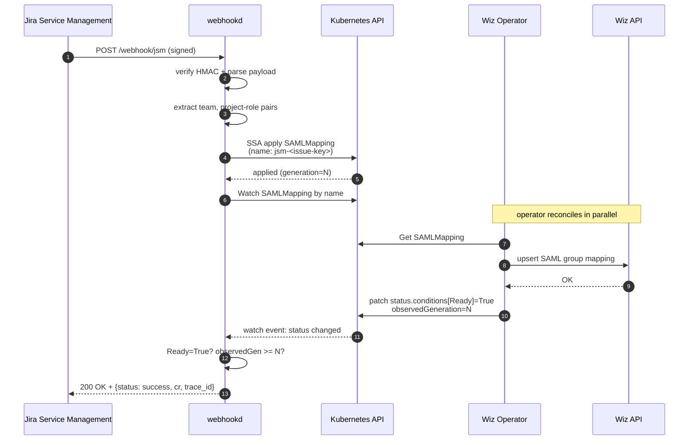

<!-- markdownlint-disable-file MD025 MD041 -->

# DESIGN 0002: JSM Webhook → SAMLMapping Provisioning — Phase 2

**Status:** Draft **Author:** Donald Gifford **Date:** 2026-04-21

<!--toc:start-->
- [Overview](#overview)
- [Goals and Non-Goals](#goals-and-non-goals)
  - [Goals](#goals)
  - [Non-Goals](#non-goals)
- [Background](#background)
- [Detailed Design](#detailed-design)
  - [End-to-End Flow](#end-to-end-flow)
  - [JSM Webhook Payload](#jsm-webhook-payload)
  - [Config Additions](#config-additions)
  - [The SAMLMapping CR](#the-samlmapping-cr)
  - [Provider Interface](#provider-interface)
  - [K8s Client Choice](#k8s-client-choice)
  - [Applying the CR — Server-Side Apply](#applying-the-cr--server-side-apply)
  - [Sync Detection](#sync-detection)
  - [Terminal vs Transient Failures](#terminal-vs-transient-failures)
  - [Idempotency and Concurrency](#idempotency-and-concurrency)
  - [HTTP Response Contract](#http-response-contract)
  - [Observability Additions](#observability-additions)
  - [RBAC](#rbac)
- [API / Interface Changes](#api--interface-changes)
- [Data Model](#data-model)
- [Testing Strategy](#testing-strategy)
- [Migration / Rollout Plan](#migration--rollout-plan)
- [Open Questions](#open-questions)
- [References](#references)
<!--toc:end-->

## Overview

Phase 2 turns the Phase 1 receiver from a scaffolded "log the event" service
into an actionable pipeline. It introduces the first concrete provider (Jira
Service Management) and the first concrete action (create a `SAMLMapping` custom
resource for the Wiz operator), wires them together synchronously, and returns
success or failure to JSM based on whether the operator reconciled the CR to a
Ready state.

This doc is scoped to the downstream-action half of the pipeline: JSM payload
shape, CR shape, the apply-and-watch-and-respond loop, the sync contract with
the operator, and the response contract with JSM. Phase 1 (DESIGN-0001) remains
the substrate; everything here slots into the existing middleware chain,
observability spine, and configuration model.

## Goals and Non-Goals

### Goals

- Parse a JSM status-transition webhook and extract the fields needed to build a
  `SAMLMapping`: team (SSO group name), plus one or more (project, role) pairs.
- Apply the resulting CR to Kubernetes via Server-Side Apply using
  `sigs.k8s.io/controller-runtime/pkg/client`.
- Synchronously watch the CR's status and return to JSM only when the operator
  has reported `Ready=True` or a terminal failure, or when a configured timeout
  elapses.
- Make every JSM retry idempotent by using a deterministic CR name keyed on the
  issue key.
- Classify outcomes into HTTP response codes that respect JSM's retry semantics
  (terminal vs transient).
- Extend Phase 1 observability with CR-apply metrics, sync-duration histograms,
  and per-operation spans so the whole JSM → webhookd → operator flow is
  traceable end-to-end.
- Lay the groundwork — without paying the cost yet — for Phase 3 multi-provider
  support: introduce a small `Provider` interface that the JSM handler
  implements, and route `/webhook/{provider}` through a dispatcher. This is a
  cheap refactor (tens of lines) that makes the JSM package self-contained and
  turns "add Slack" into a new package plus one registration line. See
  §"Provider Interface" and the companion walkthrough for the shape.

### Non-Goals

- **Multi-provider registry framework.** We introduce a minimal `Provider`
  interface and a hand-written dispatcher (see §"Provider Interface"), but no
  plugin system, no capability declarations, no provider SDK, no config schema
  per provider. Registration is a single line in `main.go`. Anything heavier
  waits until we actually have three-plus providers.
- **Worker-queue / async execution model.** The handler does its own work
  synchronously on the request goroutine. An internal queue would break the
  synchronous response contract with JSM and duplicate the retry mechanism JSM
  already gives us for free. A separate async path (for providers that do not
  need a synchronous outcome) is Phase 3 at earliest, and only if a concrete
  second provider demands it.
- **Update / delete lifecycle.** Phase 2 is apply-only. If a ticket is re-opened
  or cancelled, the resulting CR stays as-is. Cleanup on ticket closure is Phase
  2.5.
- **Drift reconciliation.** If someone edits the CR by hand, the operator's
  reconcile loop owns it — webhookd does not re-assert.
- **Asynchronous response to JSM.** We do not call back via the JSM REST API
  after the fact. JSM gets its answer in the HTTP response body. Async callback
  would let us decouple sync detection from the request, but adds JSM API
  credentials, rate limiting, and retry plumbing that are not justified at Phase
  2 volume.
- **Queuing or backpressure.** If the operator is slow, we block the caller up
  to the configured timeout and return 504. A proper queue is Phase 3.
- **Per-tenant namespace fan-out.** All CRs land in one configured namespace.
- **Operator-side tracing instrumentation.** This doc assumes operator
  reconcilers read the trace-id annotation and emit linked spans; implementation
  of that is a separate effort owned by the operator team.

## Background

Two things drive the shape of this phase:

1. **Access provisioning is already a ticketed workflow.** Teams request Wiz
   access via a JSM ticket that is reviewed and approved through the standard
   JSM workflow. When the ticket reaches a specific status (e.g. "Ready to
   Provision"), the approval is done and the provisioning should happen
   automatically. JSM is the system of record; webhookd is the mechanism. The
   ticket's status transition is the authoritative trigger.

2. **The Wiz operator already knows how to do the work.** The operator
   reconciles `SAMLMapping` CRs against the Wiz API, maintaining the
   team-to-role-to-project mapping in Wiz. What it does not have is a way to be
   told what mappings to create. webhookd fills that gap: it is the "translation
   layer" from a JSM ticket to a declarative CR. Once the CR is in the cluster,
   the operator takes over and webhookd's job is done.

The natural dividing line between the two systems is the CR. JSM does not know
about Kubernetes; the operator does not know about JSM. webhookd sits exactly on
that boundary. The synchronous sync-and-respond contract exists because JSM's
ticket state machine wants an answer before it advances — if we returned 202
immediately on receipt and the CR then failed, the ticket would be stuck in
"Provisioning in Progress" with no mechanism to correct itself.

## Detailed Design

### End-to-End Flow



Timeout path: if the watch has not observed a satisfying condition within
`WEBHOOK_CR_SYNC_TIMEOUT`, webhookd returns 504 and lets JSM decide whether to
retry. The CR remains in the cluster; the operator will eventually reconcile it.
On retry, webhookd re-applies the same CR (SSA is a no-op if the spec is
unchanged) and re-watches — which often finds the CR already Ready and returns
immediately.

### JSM Webhook Payload

A JSM automation rule is configured to fire on the target status transition. The
webhook body is JSON with at least these fields that matter to us:

```json
{
  "issue": {
    "key": "SEC-1234",
    "fields": {
      "status": { "name": "Ready to Provision" },
      "customfield_10201": "wiz-engineering-admins",
      "customfield_10202": [
        { "project": "aws-prod", "role": "ProjectAdmin" },
        { "project": "aws-nonprod", "role": "ProjectReader" }
      ]
    }
  },
  "webhookEvent": "jira:issue_updated",
  "timestamp": 1745280000000
}
```

Field IDs are tenant-specific. They are configured via environment variables,
not hardcoded. The shape of `customfield_10202` depends on whether the ticket
uses a JSM Form (structured JSON) or a free-text field. Both paths are supported
via a strategy switch:

| `WEBHOOK_JSM_PROJECT_ROLES_FORMAT` | Expected field shape                | Parser                              |
| ---------------------------------- | ----------------------------------- | ----------------------------------- |
| `form` _(default)_                 | JSON array of `{project, role}`     | `json.Unmarshal` into a typed slice |
| `text`                             | Line-delimited `project=role` pairs | Line splitter with `=` separator    |

The `text` fallback exists because JSM Forms rollout is not universal across all
projects. If we only supported `form`, we would be blocked on JSM admin work
before going live. `text` gives us a path to ship.

### Config Additions

Everything new in Phase 2, in the same `WEBHOOK_*` namespace:

| Variable                           | Default              | Purpose                                                                     |
| ---------------------------------- | -------------------- | --------------------------------------------------------------------------- |
| `WEBHOOK_JSM_TRIGGER_STATUS`       | `Ready to Provision` | Status name that fires the action. Other statuses return 200 no-op.         |
| `WEBHOOK_JSM_FIELD_TEAM`           | _required_           | Custom field ID for the SSO team group (e.g. `customfield_10201`).          |
| `WEBHOOK_JSM_FIELD_PROJECT_ROLES`  | _required_           | Custom field ID for the project-role list.                                  |
| `WEBHOOK_JSM_PROJECT_ROLES_FORMAT` | `form`               | `form` or `text`. See table above.                                          |
| `WEBHOOK_CR_NAMESPACE`             | `wiz-operator`       | Namespace where CRs are applied.                                            |
| `WEBHOOK_CR_API_GROUP`             | `wiz.example.com`    | CRD group.                                                                  |
| `WEBHOOK_CR_API_VERSION`           | `v1alpha1`           | CRD version.                                                                |
| `WEBHOOK_CR_FIELD_MANAGER`         | `webhookd`           | SSA `fieldManager` identity.                                                |
| `WEBHOOK_CR_SYNC_TIMEOUT`          | `20s`                | Max time to wait for the CR to become Ready. Must be < JSM webhook timeout. |
| `WEBHOOK_KUBECONFIG`               | _empty_              | Optional kubeconfig path; empty uses in-cluster config.                     |

### The SAMLMapping CR

This schema is what webhookd will emit. It matches what the Wiz operator team
has proposed (see Open Questions — needs final sign-off before we merge).

```yaml
apiVersion: wiz.example.com/v1alpha1
kind: SAMLMapping
metadata:
  name: jsm-sec-1234
  namespace: wiz-operator
  labels:
    webhookd.wiz.io/managed-by: webhookd
    webhookd.wiz.io/source: jsm
  annotations:
    webhookd.wiz.io/jsm-issue-key: SEC-1234
    webhookd.wiz.io/trace-id: "0af7651916cd43dd8448eb211c80319c"
    webhookd.wiz.io/request-id: "01HRF..."
    webhookd.wiz.io/applied-at: "2026-04-21T14:32:07Z"
spec:
  team: "wiz-engineering-admins"
  projects:
    - name: "aws-prod"
      role: "ProjectAdmin"
    - name: "aws-nonprod"
      role: "ProjectReader"
status:
  observedGeneration: 1
  conditions:
    - type: Ready
      status: "True"
      reason: Synced
      message: "SAML mapping applied to Wiz"
      lastTransitionTime: "2026-04-21T14:32:09Z"
```

**Naming convention:** `jsm-<issue-key-lower>`. JSM keys like `SEC-1234`
normalize to `sec-1234` (lowercased, already DNS-1123 compatible because JSM
keys are `[A-Z]+-[0-9]+`). This gives us perfect idempotency: the same ticket
always maps to the same CR name, across retries and across webhookd replicas.

**Annotations over labels for trace context.** Trace ID, request ID, and issue
key go in annotations because they are informational, not selector-relevant.
Labels are used only for the two things we might query by: `managed-by=webhookd`
and `source=jsm`. Keeping label cardinality low matters because every label
becomes an index in the etcd backing store.

### Provider Interface

Rather than wiring the JSM handler directly into the mux, Phase 2 introduces a
minimal `Provider` interface and a small dispatcher. The goal is purely code
organization: the JSM package becomes self-contained, the dispatcher owns
routing, and adding a future provider is mechanical.

```go
// internal/webhook/provider.go
type Provider interface {
    // Name is the path segment, e.g. "jsm". Must match the
    // registration key; used for metrics labels and logging.
    Name() string

    // VerifySignature validates the request's authenticity using
    // provider-specific conventions (HMAC header name, algorithm,
    // canonical body). Returns nil on success.
    VerifySignature(r *http.Request, body []byte) error

    // Handle consumes the verified body and produces an Action
    // describing the work to do. Handle is pure — it does no I/O
    // against Kubernetes or any other side-effectful system. The
    // dispatcher executes the returned Action.
    Handle(ctx context.Context, body []byte) (Action, error)
}
```

The `Action` type is a typed union of work the dispatcher knows how to execute.
In Phase 2 there is exactly one variant:

```go
// internal/webhook/action.go
type Action interface{ isAction() }

type ApplySAMLMapping struct {
    IssueKey string                 // for CR naming and annotations
    Spec     wizv1alpha1.SAMLMapping Spec
    TraceCtx context.Context         // carries request trace
}

func (ApplySAMLMapping) isAction() {}

// NoopAction is what providers return when the webhook was
// received but intentionally does nothing (e.g. status didn't
// match the trigger).
type NoopAction struct{ Reason string }

func (NoopAction) isAction() {}
```

Phase 3 can add `PostSlackMessage`, `CreateGitHubIssue`, etc. without changing
the `Provider` contract — only the dispatcher's action-execution switch grows.

**Dispatcher.** The dispatcher is ~30 lines:

```go
// internal/webhook/dispatcher.go
type Dispatcher struct {
    providers map[string]Provider
    executor  ActionExecutor   // applies the action to K8s, etc.
    metrics   *observability.Metrics
}

func (d *Dispatcher) ServeHTTP(w http.ResponseWriter, r *http.Request) {
    name := r.PathValue("provider")
    p, ok := d.providers[name]
    if !ok {
        http.Error(w, "unknown provider", http.StatusNotFound)
        return
    }

    body, err := io.ReadAll(http.MaxBytesReader(w, r.Body, d.maxBody))
    if err != nil { /* 400 */ return }

    if err := p.VerifySignature(r, body); err != nil { /* 401 */ return }

    action, err := p.Handle(r.Context(), body)
    if err != nil { /* classify + respond */ return }

    result := d.executor.Execute(r.Context(), action)
    d.writeResponse(w, r, p, result)
}
```

**Registration in `main.go`:**

```go
dispatcher := webhook.NewDispatcher(
    webhook.WithProvider(jsm.New(cfg.JSM)),
    webhook.WithExecutor(executor),
    webhook.WithMetrics(metrics),
)
publicMux.Handle("POST /webhook/{provider}", dispatcher)
```

Adding Slack in Phase 3 is one more `WithProvider(slack.New(cfg.Slack))` line
plus the `slack` package implementing the interface.

**What this intentionally does not do.** No plugin system (no `.so` loading, no
RPC). No capability declarations ("this provider supports replay"). No
per-provider config schema framework — providers read their own
`WEBHOOK_<PROVIDER>_*` env vars the same way the root config does. No async
execution path — the dispatcher calls `executor.Execute` synchronously. Every
one of those additions has a real cost and waits for a real need.

**Why Handle is pure and the dispatcher executes.** Separating the "decide what
to do" step from the "do it" step gives us two things: handlers become trivially
testable (no K8s in the test, just assertions on the returned `Action`), and the
execution path stays in one place where cross-cutting concerns like span
creation for `k8s.apply`, retry classification, and the JSM response contract
live. Without this split, each provider would re-implement those concerns and
drift.

Inside `internal/webhook/`:

```
internal/webhook/
├── provider.go       # Provider interface
├── action.go         # Action union + concrete variants
├── dispatcher.go     # routes /webhook/{provider}, executes actions
├── executor.go       # ActionExecutor: applies actions to K8s
└── jsm/              # JSM-specific Provider implementation
    ├── provider.go   # implements webhook.Provider
    ├── payload.go    # JSM JSON struct + Decode()
    ├── extract.go    # field extraction, format switching
    └── response.go   # response shape + HTTP status mapping
```

The JSM `Provider.Handle` method is deliberately linear and short:

```go
func (p *Provider) Handle(ctx context.Context, body []byte) (webhook.Action, error) {
    payload, err := p.decode(ctx, body)               // jsm.parse span
    if err != nil {
        return nil, errBadRequest(err)
    }
    if payload.Status() != p.cfg.TriggerStatus {
        return webhook.NoopAction{
            Reason: "status " + payload.Status() + " is not a trigger",
        }, nil
    }

    spec, err := p.extract(ctx, payload)              // jsm.extract_fields span
    if err != nil {
        return nil, errUnprocessable(err)
    }

    return webhook.ApplySAMLMapping{
        IssueKey: payload.IssueKey(),
        Spec:     spec,
        TraceCtx: ctx,
    }, nil
}
```

The dispatcher's executor owns the K8s-touching steps (`k8s.apply`,
`k8s.watch_cr`) and the response classification:

```go
func (e *Executor) Execute(ctx context.Context, a webhook.Action) ExecResult {
    switch act := a.(type) {
    case webhook.NoopAction:
        return ExecResult{Kind: ResultNoop, Reason: act.Reason}
    case webhook.ApplySAMLMapping:
        applied, err := e.apply(ctx, act)             // k8s.apply span
        if err != nil {
            return classifyK8sErr(err)
        }
        return e.waitForSync(ctx, applied)            // k8s.watch_cr span
    default:
        return ExecResult{Kind: ResultInternalError, Reason: "unknown action"}
    }
}
```

Each step owns a span, records its own metrics, and returns a typed result. The
split means provider packages are pure parsers: `jsm.Provider.Handle` is
directly unit-testable with no K8s, no HTTP, no test server — just "give it a
body, assert it returned the right `Action`."

### K8s Client Choice

`sigs.k8s.io/controller-runtime/pkg/client` with the operator's API types
registered in a scheme:

```go
import (
    wizv1alpha1 "github.com/our-org/wiz-operator/api/v1alpha1"
    ctrl "sigs.k8s.io/controller-runtime"
    "sigs.k8s.io/controller-runtime/pkg/client"
)

func newK8sClient() (client.Client, error) {
    scheme := runtime.NewScheme()
    _ = wizv1alpha1.AddToScheme(scheme)

    cfg, err := ctrl.GetConfig() // honors KUBECONFIG + in-cluster
    if err != nil {
        return nil, fmt.Errorf("k8s config: %w", err)
    }
    return client.New(cfg, client.Options{Scheme: scheme})
}
```

**Why controller-runtime over raw client-go.** controller-runtime's
`client.Client` is the de-facto modern K8s client in Go. It gives us a clean
`Get`, `Patch`, `Watch` API over typed objects, bakes in SSA via `client.Apply`,
and is what the operator itself uses — one fewer mental model for engineers
switching between the two codebases.

**Why typed over dynamic.** Dynamic (unstructured) client would let webhookd
avoid importing the operator's Go module, which sounds appealing for coupling.
But we are one team, building both halves, and the operator project already
exports its API types. Typed gives compile-time safety on field names — a spec
typo gets caught at build time rather than at runtime admission. The coupling is
worth it. If the operator ever becomes a third-party product we have to
integrate with, migrating to dynamic is a mechanical refactor.

### Applying the CR — Server-Side Apply

```go
obj := &wizv1alpha1.SAMLMapping{
    TypeMeta: metav1.TypeMeta{
        APIVersion: wizv1alpha1.GroupVersion.String(),
        Kind:       "SAMLMapping",
    },
    ObjectMeta: metav1.ObjectMeta{
        Name:      crName(payload.IssueKey()),
        Namespace: h.cfg.CRNamespace,
        Labels: map[string]string{
            "webhookd.wiz.io/managed-by": "webhookd",
            "webhookd.wiz.io/source":     "jsm",
        },
        Annotations: annotations(ctx, payload),
    },
    Spec: spec,
}

err := h.k8s.Patch(ctx, obj,
    client.Apply,
    client.FieldOwner(h.cfg.CRFieldManager),
    client.ForceOwnership,
)
```

SSA handles three cases in one call:

1. **CR does not exist** — created with webhookd as field owner.
2. **CR exists with identical spec** — no-op, no generation bump, operator does
   not reconcile again. This is the JSM-retry case.
3. **CR exists with different spec** — updated; generation bumps; operator
   reconciles the new desired state. This is the ticket-edited-and-resubmitted
   case.

`ForceOwnership` ensures that if some other manager (a human using
`kubectl edit`, say) previously touched fields we now want to own, we take
ownership back. The tradeoff is that we stamp over manual edits. That is the
right default: the CR is supposed to be webhookd-owned.

The observed `generation` from the apply response is captured and passed into
the watch step.

### Sync Detection

```go
type SyncResult int
const (
    SyncReady      SyncResult = iota // Ready=True, observedGen >= N
    SyncFailed                       // Ready=False with terminal reason
    SyncTimedOut                     // timeout elapsed
    SyncK8sError                     // watch errored out
)

func (h *Handler) waitForSync(ctx context.Context, applied *wizv1alpha1.SAMLMapping) SyncResult {
    ctx, cancel := context.WithTimeout(ctx, h.cfg.CRSyncTimeout)
    defer cancel()

    lw := &cache.ListWatch{
        ListFunc:  /* list by name */,
        WatchFunc: /* watch by name, resourceVersion=applied.ResourceVersion */,
    }
    _, err := watch.UntilWithSync(ctx, lw, &wizv1alpha1.SAMLMapping{}, nil,
        func(ev watch.Event) (bool, error) {
            obj, ok := ev.Object.(*wizv1alpha1.SAMLMapping)
            if !ok { return false, nil }
            if obj.Status.ObservedGeneration < applied.Generation {
                return false, nil // operator hasn't caught up yet
            }
            cond := findCondition(obj.Status.Conditions, "Ready")
            switch {
            case cond == nil:
                return false, nil
            case cond.Status == metav1.ConditionTrue:
                return true, nil
            case isTerminal(cond.Reason):
                return true, errTerminal(cond)
            }
            return false, nil
        })
    // map err -> SyncResult
}
```

Two conditions must both hold before we call it success:

1. **`observedGeneration >= metadata.generation`** — the operator has seen our
   latest apply. Without this guard, we could declare success based on a
   pre-existing Ready=True from an older generation, which would be wrong when
   the ticket has been edited.
2. **`Ready` condition `status=True`** — the operator has finished its work and
   Wiz has acknowledged.

### Terminal vs Transient Failures

The operator must surface terminal failures with a distinct reason so webhookd
can respond to JSM appropriately. Proposed convention (to be confirmed with the
operator team):

| Condition reason                | Class     | webhookd response        |
| ------------------------------- | --------- | ------------------------ |
| `Synced` / `Ready`              | Success   | 200 OK                   |
| `InvalidTeam`                   | Terminal  | 422 Unprocessable Entity |
| `UnknownProject`                | Terminal  | 422 Unprocessable Entity |
| `InvalidRole`                   | Terminal  | 422 Unprocessable Entity |
| `UpstreamUnavailable`           | Transient | 503 Service Unavailable  |
| `RateLimited`                   | Transient | 503 Service Unavailable  |
| _(unknown reason, Ready=False)_ | Transient | 503 (fail safe)          |

If the operator does not implement this reason taxonomy, we default every
`Ready=False` to transient. That is the conservative choice: JSM retries are
cheap, manual intervention on a wrongly-closed ticket is not.

### Idempotency and Concurrency

Two JSM deliveries of the same event (retry, network wobble, duplicate rule
firing) must not double-create or double-apply in any problematic way.

- **Same spec, retry:** SSA is a no-op; the second request sees the existing CR
  at the same generation, the watch finds Ready=True immediately (or
  near-immediately), returns 200.
- **Different spec, rapid edit:** SSA updates the CR (generation bump). Both
  requests may be in-flight and watching; each sees the new generation; both
  eventually return success. Not ideal (two responses for one logical
  operation), but JSM handles duplicate webhook success cleanly.
- **Different webhookd replicas handling the same event:** Same as above. No
  coordination between replicas is required because the CR name is deterministic
  and SSA is conflict-free.

### HTTP Response Contract

Response body for the JSM endpoint, always JSON:

```json
{
  "status": "success" | "failure" | "noop",
  "reason": "string, human-readable",
  "cr": "jsm-sec-1234",
  "namespace": "wiz-operator",
  "trace_id": "0af7651916cd43dd8448eb211c80319c",
  "request_id": "01HRF..."
}
```

Status code mapping:

| Code | Meaning                                             | JSM should…                                            |
| ---- | --------------------------------------------------- | ------------------------------------------------------ |
| 200  | Synced successfully or status-didn't-match no-op    | advance ticket                                         |
| 400  | Malformed payload                                   | page a human; don't retry                              |
| 401  | HMAC signature invalid                              | page a human; don't retry                              |
| 422  | Operator reports terminal failure (invalid input)   | reject the ticket, surface the reason to the requester |
| 504  | Sync timed out (CR applied, not yet Ready)          | retry                                                  |
| 503  | Operator reports transient failure, or K8s API down | retry                                                  |
| 500  | Unexpected internal error                           | retry (with backoff)                                   |

JSM automation rules can branch on status code + response body, so surfacing
`reason` lets the ticket comment or description quote it back to the requester
("Unknown project: aws-sandbox").

### Observability Additions

**New metrics** (added to the `Metrics` struct from Phase 1's
`internal/observability/metrics.go`):

```
webhookd_cr_apply_total{kind, outcome}
  outcome: created | updated | unchanged | error

webhookd_cr_sync_duration_seconds{kind, outcome}
  outcome: ready | failed | timeout
  buckets: 0.1, 0.25, 0.5, 1, 2, 5, 10, 20, 30

webhookd_jsm_payload_parse_errors_total{reason}
  reason: invalid_json | missing_field | wrong_status | field_format

webhookd_jsm_noop_total{trigger_status}
  # counted when we receive a webhook but the status doesn't match
  # the trigger; useful for spotting misconfigured automation rules

webhookd_jsm_response_total{status_code}
```

**New spans** (all children of the `otelhttp` server span):

- `jsm.decode_payload` — raw JSON decode
- `jsm.extract_fields` — custom field extraction; attributes include
  `jsm.issue_key`, `jsm.field_format`
- `k8s.apply` — SSA call; attributes include `k8s.resource.kind`,
  `k8s.resource.name`, `k8s.resource.namespace`, `k8s.generation`
- `k8s.watch_cr` — the wait loop; attributes include `k8s.sync.outcome` at close
- `jsm.build_response` — response serialization

**Trace propagation across the CR boundary:**

The trace ID is stamped into the CR as the `webhookd.wiz.io/trace-id`
annotation. The operator's reconciler reads this annotation when it picks up the
CR and starts its own span with the trace ID as the parent (via
`trace.SpanContextFromContext` with a manually-constructed remote parent). This
means a Grafana Tempo query on the JSM-delivered trace ID shows:

```
└── POST /webhook/jsm              [webhookd]
    ├── jsm.decode_payload
    ├── jsm.extract_fields
    ├── k8s.apply
    ├── k8s.watch_cr
    └── operator.reconcile          [wiz-operator]    ← remote parent
        ├── wiz.resolve_team
        ├── wiz.upsert_mapping
        └── k8s.patch_status
```

The annotation-to-span bridging happens inside the operator. We do not propagate
via context (obviously — the CR sits in etcd for a while; there is no live
context to carry). The annotation is a durable trace-parent header.

### RBAC

ClusterRole for the webhookd ServiceAccount (or Role in `wiz-operator` namespace
if we want tighter scoping):

```yaml
rules:
  - apiGroups: ["wiz.example.com"]
    resources: ["samlmappings"]
    verbs: ["get", "list", "watch", "patch"]
  # patch covers SSA; create is not needed because SSA is a patch
```

Namespace-scoped Role is preferred. ClusterRole is only needed if we later
support multi-namespace fan-out.

## API / Interface Changes

- **New route on the Phase 1 mux**: `POST /webhook/jsm`. The path parameter
  `{provider}` already exists from Phase 1; JSM is the first concrete value it
  takes.
- **New response body** on `/webhook/jsm` as specified above. Previously Phase 1
  returned an empty body on 202.
- **New CR**: `SAMLMapping` in `wiz.example.com/v1alpha1`. Owned by the operator
  project's CRD; webhookd is a consumer of the API.
- **New metrics** as above; all prefixed `webhookd_`.

## Data Model

Still stateless from webhookd's perspective. The "state" now lives in the
cluster as CRs, but webhookd owns no persistence. Crash semantics:

- A crash during SSA before the API call returns → on retry, SSA is re-applied
  (idempotent).
- A crash during the watch → on retry, SSA re-applies (no-op if unchanged),
  watch restarts. The operator may have already reconciled; the second watch
  finds Ready=True immediately.
- A crash between watch-observed-Ready and HTTP response write → JSM times out
  and retries; retry sees Ready immediately.

Every failure mode is recoverable by re-delivery.

## Testing Strategy

**Unit tests** (stdlib `testing`, table-driven):

- `jsm/payload` — decode tests for valid JSM payloads, malformed JSON, missing
  `issue.fields.status`, wrong status value.
- `jsm/extract` — field extraction for both `form` and `text` formats, missing
  custom fields, malformed entries, empty lists, whitespace handling.
- `jsm/cr` — CR construction from extracted spec, annotation stamping, name
  normalization (`SEC-1234` → `jsm-sec-1234`).
- `classifyK8sErr` — every known K8s error class maps to the expected HTTP
  status.

**Integration tests** (`envtest` — K8s API server in-process):

- Happy path: apply CR, simulate operator by patching status, watch returns
  Ready, handler returns 200.
- Timeout path: apply CR, never patch status, handler returns 504 within ~1s of
  the configured timeout.
- Idempotency: apply twice concurrently, assert only one generation bump (or two
  identical), both requests return success.
- Terminal failure: simulate operator setting `Ready=False, Reason=InvalidTeam`,
  handler returns 422.

**Fuzz target:** `FuzzJSMDecode` on the payload decoder, seeded with real
anonymized JSM webhook samples.

**End-to-end test** (kind + real operator deployed; out of CI, run before
release):

- Deploy operator + webhookd on kind, POST a signed JSM payload referencing a
  real Wiz sandbox team, assert the CR reaches Ready and the Wiz API reflects
  the mapping. Use a recorded Wiz API transport for CI runs; use the real
  sandbox for release validation.

## Migration / Rollout Plan

1. **Week 1:** Implement and land Phase 2; CI green including envtest
   integration suite.
2. **Week 2:** Deploy to non-prod, configure JSM automation rule on one test
   project pointing at non-prod webhookd. Run five test tickets through the full
   pipeline. Validate metrics, traces, and JSM ticket transitions.
3. **Week 3:** Production rollout. Enable the JSM rule on one pilot team's
   project. Monitor `webhookd_cr_sync_duration_seconds` p95/p99 and
   `webhookd_cr_sync_timeout_total` — if timeouts are non-zero, tune
   `WEBHOOK_CR_SYNC_TIMEOUT` upward (within JSM's webhook timeout) before
   broader rollout.
4. **Week 4:** Expand to all teams that provision via the standard workflow.

Rollback: disable the JSM automation rule. Existing CRs stay in the cluster;
operator continues to reconcile them. No data migration.

## Open Questions

- **SAMLMapping CRD shape.** The `spec.team` + `spec.projects[]` shape in this
  doc is based on the operator design discussions but needs a final review with
  the operator owners before code is written. If the final CRD differs, only the
  `jsm/cr.go` construction code changes.
- **Terminal-vs-transient reason taxonomy.** The operator needs to commit to a
  stable set of condition reasons (§"Terminal vs Transient Failures"). Without
  it, webhookd conservatively returns 503 for every failure, which means JSM
  retries permanent errors forever. This is acceptable for Phase 2 ramp-up but
  should be resolved before broad rollout.
- **JSM webhook timeout.** Default `WEBHOOK_CR_SYNC_TIMEOUT=20s` assumes JSM's
  webhook timeout is ≥30s. Confirm with the JSM admin and adjust the default if
  their tenant setting is tighter.
- **JSM field shape for project roles.** `form` vs `text`. Depends on whether
  the target JSM project uses JSM Forms. Work with the JSM admin to standardize
  on `form` where possible; `text` is a compatibility fallback.
- **Ticket re-open / cancellation cleanup.** Today, a CR persists after the
  ticket closes. Is that acceptable, or do we need a delete path triggered by
  another status transition? Probably fine for Phase 2 (Wiz mappings are meant
  to be long-lived), but worth an explicit policy statement.
- **Multi-namespace fan-out.** If different teams eventually want their CRs in
  their own namespace (for RBAC isolation, for instance), we need a mapping from
  JSM project/team to target namespace. Deferred to Phase 3.

## References

- DESIGN-0001 — Phase 1 receiver service.
- Companion walkthrough: `walk2.md` (to be migrated to `docs/impl/` or folded
  into this doc).
- ADR-0004 — controller-runtime typed client for Kubernetes access.
- ADR-0005 — Server-Side Apply for custom resource reconciliation.
- ADR-0006 — Synchronous JSM response contract (no async callback).
- Wiz operator MVP RFC and design doc (internal).
- Kubernetes Server-Side Apply:
  <https://kubernetes.io/docs/reference/using-api/server-side-apply/>
- controller-runtime client docs:
  <https://pkg.go.dev/sigs.k8s.io/controller-runtime/pkg/client>
- JSM automation webhooks:
  <https://support.atlassian.com/cloud-automation/docs/jira-automation-triggers/>
- Kubernetes watch patterns (`watch.UntilWithSync`):
  <https://pkg.go.dev/k8s.io/client-go/tools/watch>
